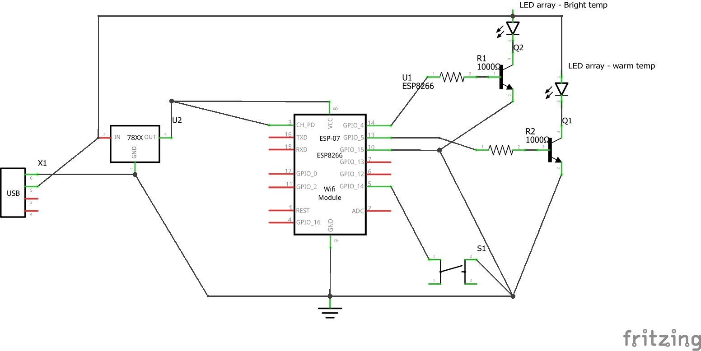

# Lamp Controller
esp 8266-based replacement for a bad microcontroller on kiddo's amazon bedside reading lamp.
Original featured soft switches for on/off and color temp. something went bad and wouldn't operate correctly.
Lamp is just two arrays of bright and warm white leds behind a diffuser on a gooseneck type thing. They share a common anode - pwm on a NPN transistor pretty simply controls light levels on each of the two channels.
## Improvements over the original
Kiddo loves reading, but can't be trusted not to turn back on late at night!
Web based panel means bright/warm channel PWM is controlled from phone. single physical soft power button for on/off can be defeated by setting the bright and warm channels to 0. Added a timer that counts down from a number of presets and switches off (but leaves PWM to settings stored in memory.). If necessary, future commit may bake in more stringent scheduling or timed setting PWM to zero rather than flipping the soft "off" switch.
## Implementing this
Opted for a raw esp-12 module for space/size advantages. In addition to that, needed a 3.3v regulator, and some basic resistors and transistors, and one push button. Used the original lamp's USB connector, wire leads, and strain relief boots that fit nicely in a replacement plastic enclosure.
### wiring

Fritzing file in this repo.
### main.py
main.py file depends on micropython running on the esp module. main.py relies on micropython's default functionality to remember and conenct to the most recent wifi network. If making with a raw module, some kind of REPL/serial console action will be required to get the chip up and running.
main.py serves up the index.html file when it recieves a GET request to the root endpoint and contains no url parameters.
### api-ish functionality
main.py will act differently if the GET request to / includes parameters with key/values in the typical ?key=value&another-key=another-value URL syntax:
 - `on`
    - purpose: turn lamp on/off, preserving PWM values in memory
    - acceptable values: `0` for off or `1` for on
 - `gpio4`
     - purpose: set the PWM duty cycle for gpio 4
    - values: integer from `0` through `1023`
 - `gpio5`
    - purpose: set the PWM duty cycle for gpio 5
    - values: integer from `0` through `1023`
 - `timeout`
    - purpose: set lamp to shut off (preserving PWM values in memory) in any number of minutes in the future.
    - values: integer
any GET to / with one or more agument(s) will return with a json structure of the state of the lamp.
If you just want the json state without changing any parameters, that can also be retrieved by making a GET request to the `/state` endpoint.

